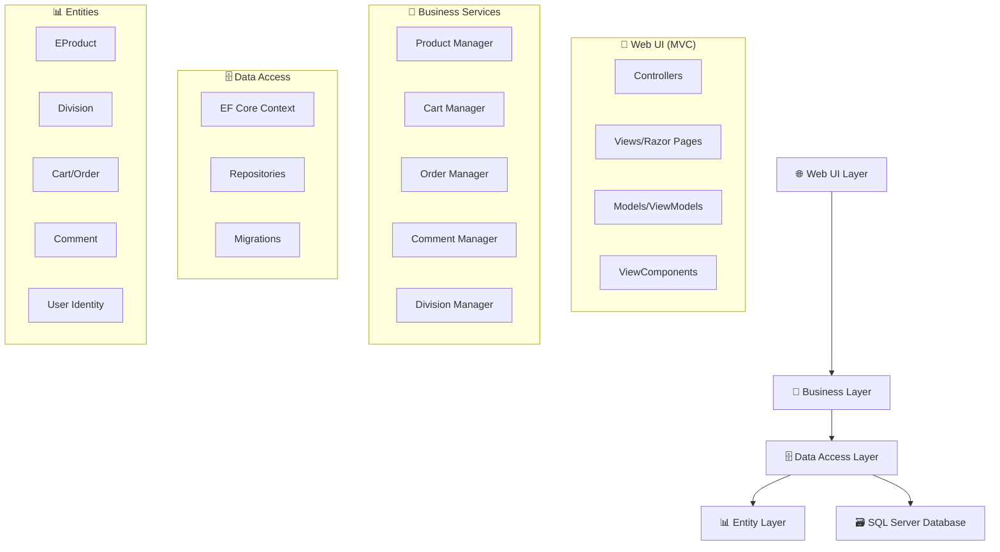

# 🎵 InstrumentHub 🎶

<div align="center">


**Modern Müzik Aletleri E-Ticaret Platformu** 🚀

[](https://dotnet.microsoft.com/)
[](https://docs.microsoft.com/en-us/ef/)
[](https://www.microsoft.com/en-us/sql-server)
[](https://getbootstrap.com/)
[](https://www.iyzico.com/)

---

### 🎯 *Müziğin Dijital Kalbi* 💙

</div>

## 📖 İçindekiler

- [🌟 Özellikler](#-özellikler)
- [🏗️ Mimari Yapı](#️-mimari-yapı)
- [💻 Teknoloji Stack](#-teknoloji-stack)
- [🚀 Kurulum](#-kurulum)
- [📊 Veritabanı](#-veritabanı)
- [🎨 Ekran Görüntüleri](#-ekran-görüntüleri)
- [👥 Katkıda Bulunanlar](#-katkıda-bulunanlar)
- [📄 Lisans](#-lisans)

---

## 🌟 Özellikler

<table>
<tr>
<td width="50%">

### 🎯 **Kullanıcı Deneyimi**
- 🔐 **Güvenli Kimlik Doğrulama** - Microsoft Identity ile
- 📧 **E-posta Doğrulama** - MailHelper servisi ile
- 🛒 **Akıllı Sepet Yönetimi** - Real-time güncelleme
- ⭐ **Yorum & Puanlama Sistemi** - 5 yıldızlı değerlendirme
- 📱 **Responsive Tasarım** - Tüm cihazlara uyumlu

</td>
<td width="50%">

### 🎵 **Ürün Yönetimi**
- 🎸 **Kategori Bazlı Filtreleme** - Division sistemi
- 🔍 **Gelişmiş Arama** - Fiyat aralığı filtreleri
- 📸 **Çoklu Görsel Desteği** - Image management
- 💰 **Dinamik Fiyatlandırma** - Esnek fiyat yapısı
- 📦 **Stok Takibi** - Real-time envanter

</td>
</tr>
</table>

### 🛡️ **Güvenlik & Ödeme**
- 💳 **Iyzipay Entegrasyonu** - Güvenli ödeme altyapısı
- 🔒 **SSL Sertifikası** - End-to-end şifreleme
- 👤 **Rol Bazlı Yetkilendirme** - Admin/User ayrımı
- 📧 **Şifre Sıfırlama** - E-posta ile güvenli sıfırlama

---

## 🏗️ Mimari Yapı



### 📁 **Proje Katmanları**

| Katman | Açıklama | Teknolojiler |
|--------|----------|-------------|
| 🌐 **WebUI** | Kullanıcı arayüzü, MVC yapısı | ASP.NET Core MVC, Razor, Bootstrap |
| 💼 **Business** | İş mantığı ve servisler | Service Pattern, Business Rules |
| 🗄️ **DataAccess** | Veri erişim katmanı | Entity Framework Core, Repository Pattern |
| 📊 **Entities** | Veri modelleri | POCO Classes, Data Annotations |

---

## 💻 Teknoloji Stack

<div align="center">

### 🖥️ **Backend Technologies**


### 🎨 **Frontend Technologies**


### 🔧 **Tools & Services**


</div>

---

## 🚀 Kurulum

### 📋 **Gereksinimler**
- ✅ .NET 8 SDK
- ✅ SQL Server (LocalDB veya Full)
- ✅ Visual Studio 2022+ / VS Code
- ✅ Git

### 🔧 **Adım Adım Kurulum**

```bash
# 1️⃣ Projeyi klonlayın
git clone https://github.com/yourusername/INSTRUMENTHUB.git
cd INSTRUMENTHUB

# 2️⃣ Bağımlılıkları yükleyin
dotnet restore

# 3️⃣ Veritabanını oluşturun
cd InstrumentHub.WebUI
dotnet ef database update --project ../InstrumentHub.DataAccess

# 4️⃣ Projeyi çalıştırın
dotnet run
```

### ⚙️ **Yapılandırma**

1. **📄 appsettings.json** dosyasını düzenleyin:

```json
{
  "ConnectionStrings": {
    "DefaultConnection": "Server=(localdb)\\mssqllocaldb;Database=InstrumentHubDb;Trusted_Connection=true;",
    "IdentityConnection": "Server=(localdb)\\mssqllocaldb;Database=InstrumentHubIdentityDb;Trusted_Connection=true;"
  },
  "EmailSettings": {
    "SmtpServer": "smtp.gmail.com",
    "SmtpPort": 587,
    "SmtpUsername": "your-email@gmail.com",
    "SmtpPassword": "your-app-password"
  }
}
```

2. **🔑 Iyzipay Ayarları** (opsiyonel):
```json
{
  "IyzipaySettings": {
    "ApiKey": "your-api-key",
    "SecretKey": "your-secret-key",
    "BaseUrl": "https://sandbox-api.iyzipay.com"
  }
}
```

---

## 📊 Veritabanı

### 🗂️ **Ana Tablolar**

| Tablo | Açıklama | İlişkiler |
|-------|----------|-----------|
| 🎵 **EProducts** | Müzik aletleri bilgileri | → Divisions, Comments, CartItems |
| 📂 **Divisions** | Ürün kategorileri | ← EProducts |
| 🛒 **Carts** | Sepet yönetimi | → CartItems, Users |
| 📝 **Orders** | Sipariş takibi | → OrderItems, Users |
| 💬 **Comments** | Ürün yorumları | → EProducts, Users |
| 👤 **AspNetUsers** | Kullanıcı bilgileri | Identity Framework |

### 🔄 **Migration Komutları**

```bash
# Yeni migration oluşturma
dotnet ef migrations add MigrationName --project InstrumentHub.DataAccess --startup-project InstrumentHub.WebUI

# Veritabanını güncelleme
dotnet ef database update --project InstrumentHub.DataAccess --startup-project InstrumentHub.WebUI

# Migration geri alma
dotnet ef database update PreviousMigrationName --project InstrumentHub.DataAccess --startup-project InstrumentHub.WebUI
```

---

## 🎨 Ekran Görüntüleri

<div align="center">

### 🏠 **Ana Sayfa**
*Modern ve kullanıcı dostu arayüz*

### 🛒 **Ürün Kataloğu**
*Gelişmiş filtreleme ve arama özellikleri*

### 💳 **Ödeme Sayfası**
*Güvenli Iyzipay entegrasyonu*

### 👨‍💼 **Admin Paneli**
*Kapsamlı yönetim araçları*

</div>

---

## 🛣️ API Endpoints

### 🎵 **Ürün İşlemleri**
```http
GET    /Product/                    # Tüm ürünleri listele
GET    /Product/GetByPriceRange     # Fiyat aralığına göre filtrele
POST   /Admin/CreateEProduct        # Yeni ürün ekle (Admin)
PUT    /Admin/EditEProduct/{id}     # Ürün düzenle (Admin)
DELETE /Admin/DeleteEProduct/{id}   # Ürün sil (Admin)
```

### 🛒 **Sepet İşlemleri**
```http
GET    /Basket/                     # Sepeti görüntüle
POST   /Basket/AddToCart           # Sepete ürün ekle
POST   /Basket/Checkout            # Ödeme işlemi
GET    /Basket/GetOrders           # Sipariş geçmişi
```

### 💬 **Yorum İşlemleri**
```http
POST   /Comment/Create             # Yorum ekle
GET    /Comment/GetByProduct/{id}  # Ürün yorumlarını getir
PUT    /Comment/Update/{id}        # Yorum güncelle
DELETE /Comment/Delete/{id}        # Yorum sil
```

---

## 🔒 Güvenlik

### 🛡️ **Güvenlik Önlemleri**
- ✅ **SQL Injection** koruması (Entity Framework)
- ✅ **XSS** koruması (Razor Engine)
- ✅ **CSRF** koruması (Anti-forgery tokens)
- ✅ **Input Validation** (Model validation)
- ✅ **Role-based Authorization** (Admin/User)
- ✅ **Password Hashing** (Identity Framework)

### 🔐 **Kullanıcı Rolleri**

| Rol | Yetkiler |
|-----|----------|
| 👤 **User** | Ürün görüntüleme, sepet, sipariş, yorum |
| 👨‍💼 **Admin** | Tüm kullanıcı yetkileri + Ürün/kategori yönetimi |

---

## 🧪 Test

### 🔍 **Test Komutları**
```bash
# Unit testleri çalıştırma
dotnet test

# Coverage raporu
dotnet test --collect:"XPlat Code Coverage"

# Test sonuçlarını görüntüleme
dotnet test --logger "console;verbosity=detailed"
```

---

## 📈 Performans

### ⚡ **Optimizasyon Özellikleri**
- 🚀 **Lazy Loading** - İhtiyaç anında veri yükleme
- 💾 **Caching** - Sık kullanılan verilerin önbelleklenmesi
- 📦 **Bundling & Minification** - CSS/JS optimizasyonu
- 🗂️ **Database Indexing** - Sorgu performansı
- 📱 **Responsive Images** - Mobil optimizasyon

---

## 🚀 Deployment

### 🌐 **Azure App Service**
```bash
# Azure CLI ile deploy
az webapp deploy --resource-group myResourceGroup --name myAppName --src-path ./publish.zip
```

### 🐳 **Docker**
```dockerfile
FROM mcr.microsoft.com/dotnet/aspnet:8.0
WORKDIR /app
COPY publish/ .
ENTRYPOINT ["dotnet", "InstrumentHub.WebUI.dll"]
```

---

## 🤝 Katkıda Bulunma

### 💡 **Nasıl Katkıda Bulunabilirsiniz?**

1. 🍴 Fork yapın
2. 🌿 Feature branch oluşturun (`git checkout -b feature/amazing-feature`)
3. 💾 Commit yapın (`git commit -m 'Add amazing feature'`)
4. 📤 Push yapın (`git push origin feature/amazing-feature`)
5. 🔄 Pull Request açın

### 📋 **Katkı Kuralları**
- ✅ Clean code prensiplerine uyun
- ✅ Anlamlı commit mesajları yazın
- ✅ Test coverage'ı koruyun
- ✅ Documentation güncelleyin

---

## 👥 Katkıda Bulunanlar

<div align="center">

### 🏆 **Proje Ekibi**

| Rol | İsim | GitHub |
|-----|------|--------|
| 👨‍💻 **Lead Developer** | [Adınız] | [@yourusername](https://github.com/yourusername) |
| 🎨 **UI/UX Designer** | [Tasarımcı Adı] | [@designer](https://github.com/designer) |
| 🧪 **QA Engineer** | [Test Uzmanı] | [@tester](https://github.com/tester) |

</div>

---

## 📞 İletişim

<div align="center">

### 📧 **Bize Ulaşın**

[](mailto:your-email@example.com)
[](https://linkedin.com/in/yourprofile)
[](https://twitter.com/yourhandle)

</div>

---

## 📄 Lisans

Bu proje **MIT** lisansı altında lisanslanmıştır. Detaylar için [LICENSE](LICENSE) dosyasına bakınız.

---

<div align="center">

### 🌟 **InstrumentHub'ı Beğendiniz mi?**

⭐ **Star** vererek projeyi destekleyin!


---

**🎵 Müzik Severlerin Tercihi - InstrumentHub 🎶**

*"Hayallerinizdeki enstrümana ulaşmanın en kolay yolu"*

</div>